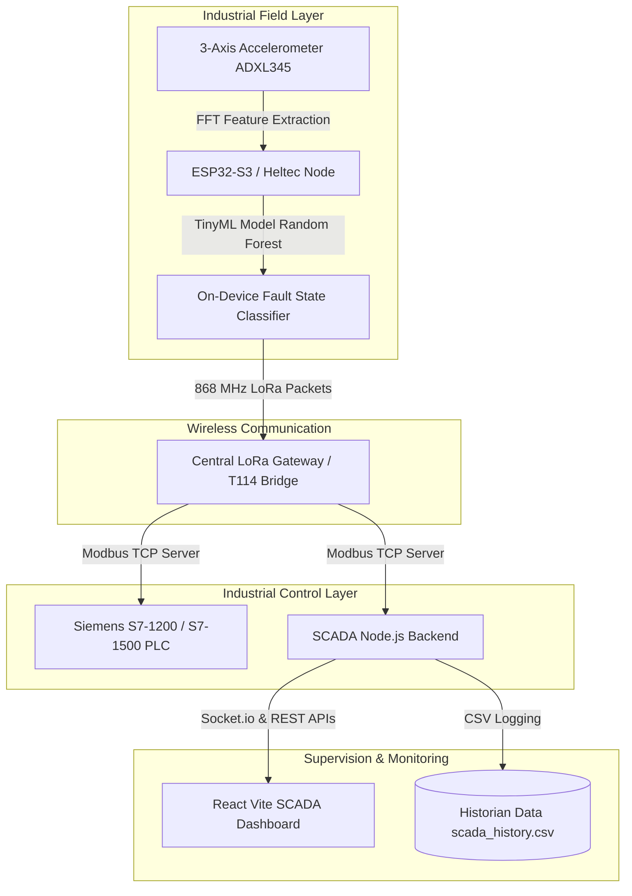

# Predictive Maintenance System — Edge AI · LoRa · Siemens S7-1200

> **Edge-to-Cloud Industrial Condition Monitoring & Vibration Diagnostic System**  
> Developed by **Ayoub Bni-Bourk** — Automation & Instrumentation Specialist.


---

## 📌 Project Overview

This project is an end-to-end **Predictive Maintenance System** designed to monitor industrial rotating equipment (motors, pumps, turbines, bearings). It combines **on-device Edge AI (TinyML)** with **long-range wireless sensor networks (LoRa 868 MHz)**, **industrial PLC integration (Siemens S7-1200/1500 over Modbus TCP)**, and a **real-time React SCADA dashboard**.

### Key Features:
- 🧠 **On-Device TinyML Classifier**: Embedded Random Forest model running directly on ESP32-S3 / Heltec Wireless Tracker to detect 5 vibration fault states (*Normal*, *Unbalance*, *Misalignment*, *Looseness*, *Bearing Fault*).
- 📶 **Long-Range LoRa Transmission**: Transmits FFT spectral features and machine health diagnostics over 868 MHz LoRa to the gateway.
- ⚡ **Modbus TCP Industrial Bridge**: Gateway exposes live telemetry via Modbus TCP holding registers for direct integration into Siemens S7-1200 / S7-1500 PLCs.
- 📊 **Real-Time React SCADA**: Live dashboard with Socket.io real-time streaming, interactive trend charts (Recharts), alarm threshold engines, and CSV data logging.

---

## 🏗 System Architecture



---

## 📂 Project Structure

```
project-Vib-PFE/
├── Central_Gateway1/                   # Central Gateway Arduino code (LoRa Receiver -> Modbus)
│   └── Central_Gateway1.ino
├── T114_vibe_bridge/                   # Heltec T114 Vibration Sensor Node + TinyML classifier
│   ├── T114_vibe_bridge.ino
│   ├── model_data.h                    # Pre-trained Random Forest model parameters
│   ├── vibe_ai.h                       # TinyML feature extraction & inference logic
│   └── adxl_live_simulator.html        # Browser live ADXL waveform simulator
├── node1/                              # LoRa Sensor Node Variant 1
│   └── T114_vibe_lora/
│       ├── T114_vibe_lora.ino
│       ├── model_data.h
│       └── vibe_ai_1.h
├── ESP-V1/ , ESP-V2/ , ESP-V3/         # Iterative ESP32 firmware variations & testing nodes
├── datasheets/                         # Component datasheets (Sensors, Transceivers)
├── pictures/                           # Architecture diagrams, spectral signatures & figures
├── pfe slides/                         # Final PFE thesis document & presentation slides
└── vibration_scada-3/vibration_scada/  # Local SCADA Web Application
    ├── backend/                        # Node.js + Express + Modbus TCP + Socket.io
    │   ├── server.js
    │   ├── scada-config.json
    │   └── scada_alarm_rules.json
    └── frontend/                       # React + Vite + Recharts + Lucide Icons
        ├── src/
        │   ├── App.jsx
        │   └── App.css
        ├── package.json
        └── vite.config.js
```

---

## 📋 Modbus TCP Telemetry Register Mapping

The Central Gateway exposes the following Modbus Holding Registers for each monitored node:

| Register Address | Data Field | Description / Value Range |
|---|---|---|
| `100` | **Status** | `0` = Offline, `1` = Normal, `2` = Warning, `3` = Fault |
| `101` | **Vibration X** | Peak acceleration / RMS on X-axis ($g$ or $mm/s$) |
| `102` | **Vibration Y** | Peak acceleration / RMS on Y-axis ($g$ or $mm/s$) |
| `103` | **Vibration Z** | Peak acceleration / RMS on Z-axis ($g$ or $mm/s$) |
| `104` | **RSSI** | Received Signal Strength Indicator (dBm) |

---

## 🚀 How to Run & Deploy

### 1️⃣ Microcontroller Firmware Setup
1. Open [T114_vibe_bridge.ino](file:///C:/Users/DELL/Desktop/project-Vib-PFE/T114_vibe_bridge/T114_vibe_bridge.ino) or [Central_Gateway1.ino](file:///C:/Users/DELL/Desktop/project-Vib-PFE/Central_Gateway1/Central_Gateway1.ino) in **Arduino IDE**.
2. Install required board packages:
   - `ESP32` by Espressif Systems
   - `Heltec ESP32 Series`
3. Install required libraries:
   - `RadioLib` or `SX126X` (for LoRa 868 MHz)
   - `Adafruit_ADXL345` & `Adafruit_Sensor`
   - `ArduinoThread` / `arduino-Modbus`
4. Compile and upload firmware to the respective Heltec / ESP32 board.

---

### 2️⃣ SCADA Backend Setup (`vibration_scada-3/vibration_scada/backend`)
```bash
# Navigate to backend directory
cd "vibration_scada-3/vibration_scada/backend"

# Install dependencies
npm install

# Start the SCADA backend server
node server.js
```
*The backend server will launch on `http://localhost:5000` and start polling the Modbus TCP gateway every 3 seconds.*

---

### 3️⃣ SCADA Frontend Setup (`vibration_scada-3/vibration_scada/frontend`)
```bash
# Navigate to frontend directory
cd "vibration_scada-3/vibration_scada/frontend"

# Install dependencies
npm install

# Start the Vite development server
npm run dev
```
*Open `http://localhost:5173` in your web browser to view the live SCADA Dashboard.*

---

## 📊 SCADA Dashboard Features

- **Overview Tab**: Real-time status cards of all industrial nodes, live vibration levels across X/Y/Z axes, and quick connection diagnostic indicators.
- **Historian Tab**: Time-series charts powered by Recharts with time window selectors, zoom, and 1-click **CSV export**.
- **Alarm Manager**: Real-time threshold evaluation with warning/critical levels, audio-visual indicators, and alarm acknowledgment logs.
- **Network Configuration**: Live configuration manager to edit gateway IP addresses, polling intervals, and Modbus register maps.

---

## 📜 Author & License

Developed by **Ayoub Bni-Bourk**  
*Automation & Instrumentation Specialist*  
- **Repository**: [PFE-Predictive-Maintenance](https://github.com/Bni-bourk/PFE-Predictive-Maintenance)  
- **LinkedIn**: [Ayoub Bni-Bourk](https://www.linkedin.com/in/ayoub-bni-bourk-136444172/)  
- **GitHub**: [@Bni-bourk](https://github.com/Bni-bourk)  
- **Email**: ayoubbnibourk728@gmail.com
