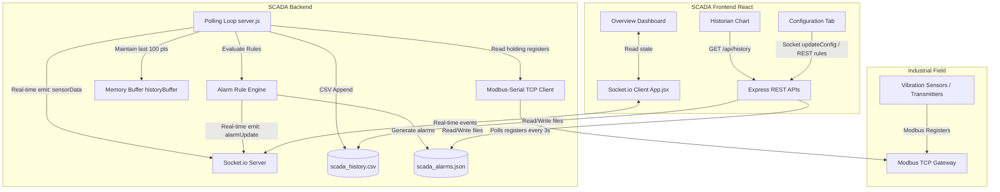

# Vibration SCADA Project Architecture & Explanation

This document serves as a persistent reference of the **Vibration SCADA** system architecture, dependencies, data flow, and codebase design. It enables quick onboarding and understanding of the codebase before making any modifications.

---

## 1. Project Directory Structure

The project is structured into three main folders:
- **`backend/`**: A Node.js application that polls Modbus TCP gateways and serves data via HTTP REST endpoints and Socket.io.
- **`frontend/`**: A React application built with Vite and styled with custom CSS, showing real-time metrics, historical trends, and alarm notifications.
- **`run-scada/`**: PowerShell scripts to start and stop both backend and frontend processes on Windows.

---

## 2. System Architecture & Data Flow

---

## 3. Backend Implementation Detail (`backend/`)

The backend is written in CommonJS Node.js and located in the [backend/](file:///c:/Users/DELL/Desktop/project-PFE/vibration_scada/backend/) directory.

### Key Files
1. **[server.js](file:///c:/Users/DELL/Desktop/project-PFE/vibration_scada/backend/server.js)**: The core server. It:
   - Configures the Express application and Socket.io server.
   - Manages TCP connections to Modbus gateways.
   - Performs concurrent register polling for all active gateways and nodes.
   - Implements the custom rule engine to detect threshold violations.
   - Handles REST APIs for historical query, alarm acknowledgement, and rule configurations.
2. **[scada-config.json](file:///c:/Users/DELL/Desktop/project-PFE/vibration_scada/backend/scada-config.json)**: Stores network parameters of the Modbus gateways (IP, port) and details of sensor nodes (register addresses, historian options).
3. **[scada_alarm_rules.json](file:///c:/Users/DELL/Desktop/project-PFE/vibration_scada/backend/scada_alarm_rules.json)**: Holds configuration rules (e.g., threshold checks on `vibX`, `vibY`, `vibZ`, `rssi`, `status`).
4. **[scada_alarms.json](file:///c:/Users/DELL/Desktop/project-PFE/vibration_scada/backend/scada_alarms.json)**: A JSON log of recent alarm events (up to 500) and their acknowledgement statuses.
5. **[scada_history.csv](file:///c:/Users/DELL/Desktop/project-PFE/vibration_scada/backend/scada_history.csv)**: Lightweight, SQLite-free tabular storage for historical data logging.

### Modbus Telemetry Mapping
For each node, the backend reads holding registers:
- **`statusReg`** (e.g. 100): Node connection or operating status.
- **`vibXReg`** (e.g. 101): Vibration on the X-axis (e.g. in `g`).
- **`vibYReg`** (e.g. 102): Vibration on the Y-axis.
- **`vibZReg`** (e.g. 103): Vibration on the Z-axis.
- **`rssiReg`** (e.g. 104): Received Signal Strength Indicator (RSSI).

*Note: The polling algorithm optimizes communications by fetching the registers in a single block (calculating `Math.min(...allRegs)` to `Math.max(...allRegs)`) to reduce TCP communication round-trips.*

### Polling Engine Delay
The polling loop completes a full cycle of all gateways and waits exactly **3000ms** (using `setTimeout(pollGateways, 3000)`) before beginning the next poll to prevent thread blocking and overlapping polls.

---

## 4. Frontend Implementation Detail (`frontend/`)

The frontend is a modern React SPA using Vite, located in [frontend/](file:///c:/Users/DELL/Desktop/project-PFE/vibration_scada/frontend/).

### Key Files
1. **[App.jsx](file:///c:/Users/DELL/Desktop/project-PFE/vibration_scada/frontend/src/App.jsx)**: Main app shell handling view switching, modal management, socket connection state, and view rendering.
   - **Tabs**:
     - *Overview*: Displays live health/communication status of all gateways and sensor tables. Clicking a row drills down into real-time KPI metrics and a live rolling line chart (Recharts with a Brush selector).
     - *Historian*: Allows querying and plotting historical data for any selected node and tag. Includes filtering by active tags and a direct CSV download trigger.
     - *Alarm Manager*: Configuration of threshold conditions (`>`, `<`, `==`, etc.) and level classification (`warning`, `critical`). Also shows a history table to acknowledge active alarms.
     - *Configuration*: Network CRUD editor for Modbus gateways and sensor registers.
     - *Communications*: Summary of TCP connection health, last poll timestamps, and errors.
2. **[App.css](file:///c:/Users/DELL/Desktop/project-PFE/vibration_scada/frontend/src/App.css)**: Implements custom modern design principles:
   - Dark theme dashboard layout with premium typography (`Inter`).
   - Rich aesthetics with subtle borders, deep glassmorphic panels, and neon accent colors representing axes:
     - **X Axis**: `#ff0055` (Pinkish Red)
     - **Y Axis**: `#00f0ff` (Cyan)
     - **Z Axis**: `#d000ff` (Purple)
   - Micro-animations for warning states (flashing pulse alarms) and smooth hover transitions.

---

## 5. Socket.io Event API Reference

Communication between frontend and backend is highly real-time:
* **`configLoaded`** (Server -> Client): Sends the current gateway configuration array upon client connection.
* **`gatewayStatus`** (Server -> Client): Transmits network status changes of gateways (connection status, poll duration, error details).
* **`sensorData`** (Server -> Client): Sends polled telemetry payload for a specific sensor node.
* **`alarmUpdate`** (Server -> Client): Dispatches new alarm creation and alarm acknowledgement events instantly.
* **`updateConfig`** (Client -> Server): Commited when configuration changes occur in the UI. Instructs the backend to write config to disk, drop existing Modbus connection handlers, and instantiate new socket instances.

---

## 6. Helper Scripts (`run-scada/`)

Simplifies development startup and execution inside Windows PowerShell:
- **[start-scada.ps1](file:///c:/Users/DELL/Desktop/project-PFE/vibration_scada/run-scada/start-scada.ps1)**:
  - Automates installation of dependencies if missing in either project directory.
  - Launches separate windows for both `node server.js` and `npm run dev` so standard outputs are visible in parallel.
- **[stop-scada.ps1](file:///c:/Users/DELL/Desktop/project-PFE/vibration_scada/run-scada/stop-scada.ps1)**:
  - Finds process IDs listening on ports `3001` (backend) and `5173` (Vite) using `netstat` and terminates them safely or forcefully.

---

## 7. Guidelines for Future Modifications

When extending or editing the codebase, keep the following in mind:
- **Adding new register types**: Update the register mapping in both frontend `DEFAULT_NODE` [App.jsx](file:///c:/Users/DELL/Desktop/project-PFE/vibration_scada/frontend/src/App.jsx#L14) and backend polling `pollGateways()` register block calculators [server.js](file:///c:/Users/DELL/Desktop/project-PFE/vibration_scada/backend/server.js#L73).
- **Archiving config**: Ensure properties modified in the Node creation form correspond to archiving settings in the backend telemetry writer.
- **File path safety**: Use `path.join(__dirname, ...)` in the backend to ensure paths resolve correctly regardless of where the start script is run from.
